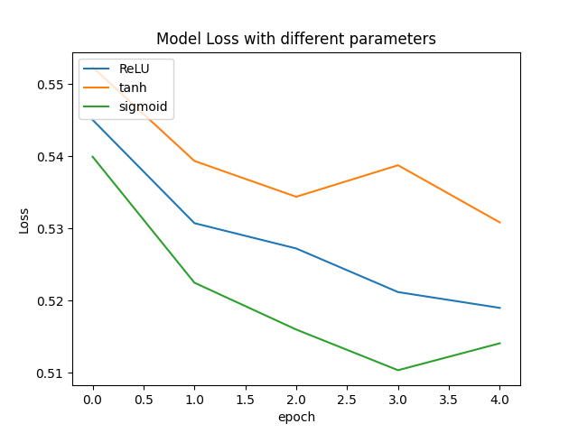

<!-- input:  [batchsize,textsize]-[256,24]
embedding: [batchsize,textsize,vecsize]-(256,24,350)
flatten (Flatten)->(None, 8400)  
Dense(None,120)
Dropout(None,120)
output_dense(None,2) -->
- Width of the network at H.L
    - neurons: 64 
        - accuracy: 0.7587 | val_accuracy: 0.7427
        - Test Accuracy: 74.24%
    - neurons: 128
        - accuracy: 0.7613 | val_accuracy: 0.7519
        - Test Accuracy: 75.14%
    - Note: Selecting 128 neurons in H.L
- Selecting dataset with stopwords. Almost similar accuracies were seen with both the datasets. Test Accuracy running baseline(No Dropout, No L2) with ReLU.
    - With stopwords: 74.45%
    - Without stopwords: 74.25%
    - Time complexity will be more but It may converge better given the fact, MNB also performed better in this case as there were stopwords contributing to sentiment.

Activation function | L2-norm regularization | Dropout | Train Accuracy(%) | Val Accuracy(%) | Test Accuracy(%)
--- | --- | --- | --- | --- | ---
relu | False | False | 78.94 | 74.23 | 74.28
relu | False | True(0.5) | 73.96 | 74.55 | 74.30    
relu | True(0.01) | True(0.5) | 63.20 | 70.74 | 70.55
relu | True(0.001) | True(0.5) | 65.60 | 69.91 | 69.90
tanh | False |False | 78.25 | 73.14 | 74.47
tanh | False |True(0.5) | 73.12 | 73.63 | 74.98    
tanh | True(0.01) | True(0.5) | 68.18 | 71.36 | 71.32
tanh | True(0.001) | True(0.5) | 70.37|  73.10 | 72.82
sigmoid | False | False | 83.84 | 74.35 | 74.18
sigmoid | False | True(0.5) | 74.84 | 74.99 | 74.25
sigmoid | True(0.01) | True(0.5) | 63.19 | 67.30 | 67.17
sigmoid | True(0.001) | True(0.5) | 68.93 | 72.02 | 71.92

Best Model at 0.2 Dropout after checking on [0.1,0.2,0.3,0.5]:
Activation function | L2-norm regularization | Dropout | Train Accuracy(%) | Val Accuracy(%) | Test Accuracy(%)
--- | --- | --- | --- | --- | ---
relu | False | True(0.2) | 73.11 | 74.76 | 74.45   
tanh | False |True(0.2) | 73.25 | 73.97 | 75.05  
sigmoid | False |True(0.2) | 74.10 | 74.14 | 74.26      

### Note: Accuracies could have been better, if made Trainables=True at embedding layer which drastically increases the time and may lead to overfitting as those weights are updated.

# Analysis
__________________________________________
### Effect of activation functions on results (ReLU,tanh,sigmoid)

- All the three activation functions provide almost similar results with a mean change in accuracy of (+-)1% for all the models.
- tanh works better than ReLU and sigmoid by 1% of accuracy and it took 120s/epoch which is slightly more than the ReLU taking 96s(approx).
        ReLU being a ramp function, doesn't end up with vanishing gradient in case of deep networks whereas, sigmoid functions may end up in vanishing gradient problem i.e. if x<-2(lets say) or x>2, theh derivative becomes small and model may not be able to converge leading to a non firing dead neuron. No problem of dying ReLU was expected or seen. Tested separately using "tf.keras.backend.gradients".
- On the other hand "tanh" works slightly better than the sigmoid in our case giving an accuracy of 75.05% being costly at 120s/epoch. Reason being, the max value of derivative is upto 1.0 for tanh and 0.25 for sigmoid. So the loss was also reduced largely with large updates. 
- Time:
    - ReLU<tanh<sigmoid
- Loss(val):
    - tanh<ReLU<sigmoid (Negligible change)
- Thus, we may choose tanh if accuracy is considered leaving the time complexity behind. ReLU can be  chosen as our Activation function given the time complexity and decent accuracy with no problem of vanishing gradient.
- Note: Please see the plotted loss at bottom for 5 epochs. 
________________________________________________________
 ### Effect of L2-norm regularization
 
- An average decrease of 3-5% accuracy can be seen when using L2-norm in all the cases above.  
- Regularization penalizes the coefficients/wt. matrices to avoid overfitting. Cost function = Loss(cross entropy) + Regularization_term. It reduces the weight matrix close to zero and reduces the overfitting.
- L2 produces small non zero/non sparse coefficients/wts and when L2 used with sigmoid which is not zero averaged/centered, hence the accuracy can be seen dropping for our sparse data.
- whereas model with activation function "tanh" being zero centered isn't getting effected that much on adding l2 reg, although not improving the accuracy as well. 
- However, the training accuracy on adding l2 reg is less than the validation accuracy for all the cases.

__________________________________________
### Effect of Dropout
- Adding the dropout of 0.5 increased the validation accuracy leading to less overfitting which can also be seen on comparing the training accuracy with and without dropout.
- Dropout is also a refularization technique which randomly selects the n described nodes and removes them with all their incoming and outgoing connections in the network. 
- Thus adding randomness, we are preventing overfitting in our model. Dropout rate of 0.2 was found a decent choice for this data. 

<!-- Typically ridge or ℓ2 penalties are much better for minimizing prediction error rather than ℓ1 penalties. The reason for this is that when two predictors are highly correlated, ℓ1 regularizer will simply pick one of the two predictors. In contrast, the ℓ2 regularizer will keep both of them and jointly shrink the corresponding coefficients a little bit. Thus, while the ℓ1 penalty can certainly reduce overfitting, you may also experience a loss in predictive power. -->

Loss:

#### References:
- https://blog.keras.io/using-pre-trained-word-embeddings-in-a-keras-model.html
- https://www.analyticsvidhya.com/blog/2018/04/fundamentals-deep-learning-regularization-techniques/
 

<!-- 
66% positive relu 90% neg  78
71% positive tanh 88    79.2
67% positive sig 92 79.5 --> -->
###### commented!!